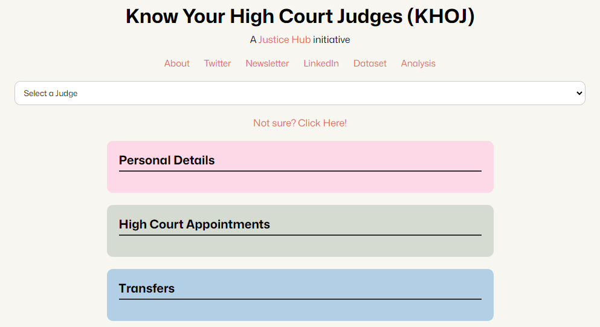

## Know your High Court Judges (KHOJ) - Data Explorer

**About the repo**

A simple web app to view data collected for judges under the KHOJ initiative

**About the initiative**
The **KHOJ (Know Your High Court Judges)** dataset includes data of more than 1700 judges appointed between 1993 (after the creation of the collegium) and 2021. The dataset captures information across 43 variables including the personal, educational and professional background of India’s High Court judges. It opens pathways for researchers who are looking to probe deeper or wider into the composition of the High Courts and those who want to undertake jurimetrics studies which explore the linkage between judicial behaviour and the background of judges.

The core philosophy behind building such a dataset is the realization that people of the country should have more information about judges whose decisions have a real impact on such people's lives.

This dataset is the result of a joint effort over 15 months involving more than 30 students and 10 professionals who volunteered their time and efforts in preparing this dataset. This was a collaboration between NLUO’s Centre for Public Policy, Law and Good Governance, Agami and CivicDataLab. It started with the Summer of Data 2021 programme where students from across the country became the original data creators using official and publicly accessible data sources.

To know more about the [KHOJ][khoj] initiative, visit [Justice Hub][JH]

[khoj]: https://justicehub.in/initiatives/khoj-india
[JH]: https://justicehub.in/
